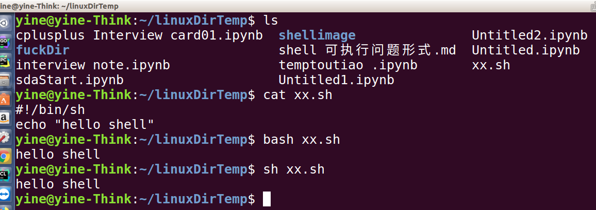
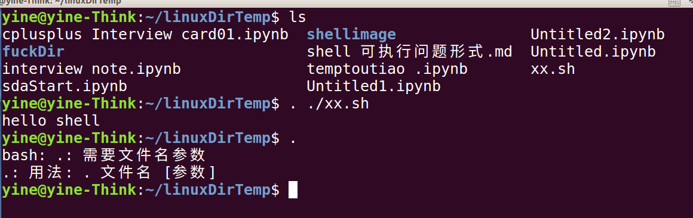
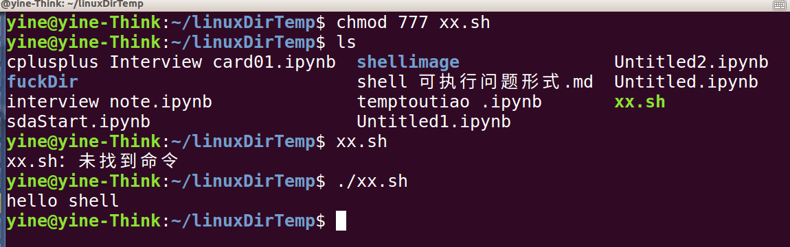

# 针对shell可执行的问题

假设有一个xx.sh文件，内容为：

```sh
#!/bin/sh
echo "hello shell"
```

说明：shell脚本的第一行通常为：#!/bin/sh
这是为了当该shell脚本为可执行文件，在终端执行时，添加的注释方便内核去使用相应的shell解释器去执行该文件。linux下有各种不同的shell解释器，如bash，sh等，一般ubuntu默认为bash

## 执行shell脚本的几种方式

1. 指定相应的shell解释器去执行



note： 此时xx.sh 文件可以没有可执行权限，因为指定了解释器去执行

2. 使用默认shell解释器去执行：



因为如果在终端直接敲入一个 . 回车的的话会需要提示传入相应的参数，而且是弹出的是bash的参数，所以表明了当前的终端使用的默认的shell解释器为bash。所以通过敲 . 直接回车的方式可以判断当前的终端环境使用的默认的shell解释器。

note： 此时xx.sh 文件可以没有可执行权限，因为使用了默认的解释器去执行

3. 使用可执行文件的方式

此时首先要给该文件添加可执行的权限：

```shell
chmod 777 xx.sh
```



此时可以看到该xx.sh在 ls 命令下显示为绿色，表示该文件为可执行文件；在使用可执行文件的方式直接执行该shell脚本时，直接输入 xx.sh 回车的方式不行，是因为终端在执行命令的时候，对于没有指定路径（绝对或者相对路径）的命令，默认是在配置的PATH的环境变量里面去寻找该命令，由于没有把当前的目录添加到PATH路径下，所以当然会找不到相应的 xx.sh 命令。因此在执行时使用 ./xx.sh  的方式，表示执行当前目录下的 xx.sh 可执行命令。同时也不能使用 /xx.sh 的方式，因为这样的话又表示执行的是根目录下的xx.sh命令，除非你当前的目录在根目录下。


